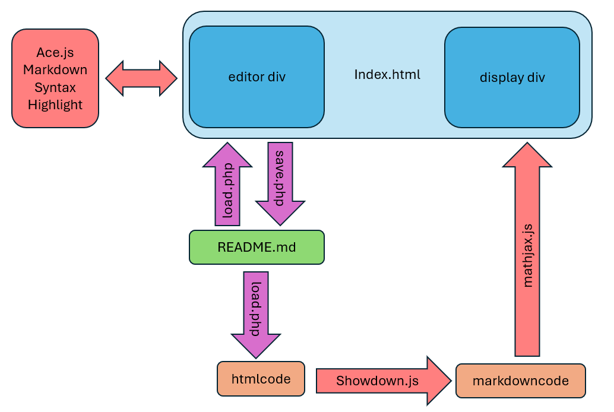

# [web-readme](https://github.com/lafefspietz/web-readme/)

A web-based README.md editor with $\LaTeX$ plus Markdown converted to HTML.  Code is formatted in the browser with the Ace.js editor.  A pair of PHP scripts save(save.php) and load(save.php) files using the JavaScript object [XMLHttpRequest](https://developer.mozilla.org/en-US/docs/Web/API/XMLHttpRequest). 

To run this, install the [xampp](https://www.apachefriends.org/) local web server, and then make the the project directory for any repository you wan to work on a sub directory of the main web direcctory(on Windows this will be c:\xampp\htdocs\). 

Once you have a live instance of this repository it will be located at [http://localhost/web-readme/](http://localhost/web-readme/). To see how the HTML is UPDATED, reload the browser.  To edit the index.html file, use the editor at [edit-index.html](edit-index.html).

## Files

 - [index.html](index.html)
 - [save.php](save.php)
 - [load.php](load.php)
 - [README.md](README.md)
 - [edit-index.html](edit-index.html)

## JavaScript Libraries

 - [showdown.js](https://showdownjs.com/)
 - [ace.js](https://ace.c9.io/)
 - [mathjax.js](https://www.mathjax.org/)

## Information Flow Diagram

## Qr Code to Github Repo:

